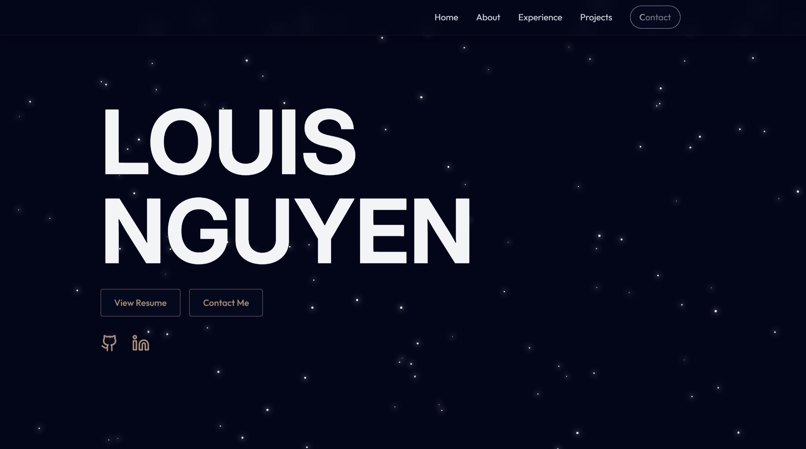

# 🌐 Louis Nguyen's Personal Portfolio

Welcome to my personal portfolio website! This site showcases who I am, my work experience, the projects I've built, the technologies I use, and how to get in touch with me.

## 🚀 Features

- **Experience**: Discover my professional and academic journey.
- **Projects**: Explore a curated collection of my work, complete with descriptions and GitHub repositories.
- **Contact**: Easily reach out through a functional contact form powered by EmailJS, or connect via LinkedIn and GitHub.
- **Responsive Design**: Fully optimized for desktops and mobile devices, with smooth transitions and clean layout.

## 🛠️ Tech Stack

- **Frontend:** React, HTML, JavaScript
- **Styling:** Tailwind CSS
- **Build Tool:** Vite
- **Deployment:** Vercel
